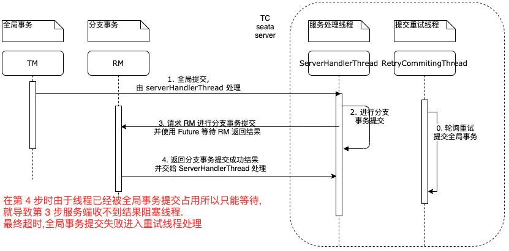

# TCC 模式高并发情况下 branch begin/commit/rollback 超时问题

seata server 使用同一个线程池处理所有的请求。线程池 coreSize=50 maxSize=500 queueSize=20000

## seata version 1.4.2

## 复现条件

1. 启动 tc 项目 (已经把 server 的线程池改为单线程(coreSize=1))
2. 启动 rm 项目
3. 启动 tm 项目;
4. 浏览器访问 [http://localhost:8080/global](http://localhost:8080/global)
   就会发现长时间不会返回。会在大约 30s 后成功返回`ok`

## 原因分析

### 在 TCC 模式下。

server 在接收到 global commit/rollback 请求后会放入线程池中处理,' 在 global commit/rollback 过程中会调用 branch 的 commit/rollback。
(代码参考 `io.seata.server.coordinator.DefaultCore#doGlobalCommit`)。 branch commit/rollback 是先给 RM 发送 commit/rollback
请求并构造一个 Future 等待RM返回结果。  
这个时候就会出现问题。  
由于线程池只有一个 global commit/rollback 时已经占用了线程。然后 rm 进行 branch commit/rollback返回结果时就没有线程能过处理这个请求，一直等待. 造成类似死锁问题。最终 Future 等待
30s 超时。 然后在`io.seata.server.coordinator.DefaultCoordinator`中会有一个 retryCommitting 的线程池来做 global commit/rollback 这时候 和
branch commit/rollback 就不会使用同一个线程池了。最终整个分布式事务完成  
但是这个等待超时就会严重影响正常的业务逻辑了  
***以上是 server 处理线程池只有 1 个的情况。默认 50 个的情况下在高并发时也会出现这个问题***

### 流程图



具体错误堆栈如下

```
14:40:29.431 ERROR --- [  ServerHandlerThread_1_1] i.s.c.e.AbstractExceptionHandler         : Catch TransactionException while do RPC, request: xid=192.168.18.115:8091:131405855596744704,extraData=null
==>
io.seata.core.exception.TransactionException: io.seata.core.exception.BranchTransactionException: Send branch commit failed, xid = 192.168.18.115:8091:131405855596744704 branchId = 131405855747739648
	at io.seata.server.coordinator.DefaultCore.doGlobalCommit(DefaultCore.java:235)
	at io.seata.server.coordinator.DefaultCore.commit(DefaultCore.java:164)
	at io.seata.server.coordinator.DefaultCoordinator.doGlobalCommit(DefaultCoordinator.java:167)
	at io.seata.server.AbstractTCInboundHandler$2.execute(AbstractTCInboundHandler.java:95)
	at io.seata.server.AbstractTCInboundHandler$2.execute(AbstractTCInboundHandler.java:90)
	at io.seata.core.exception.AbstractExceptionHandler.exceptionHandleTemplate(AbstractExceptionHandler.java:116)
	at io.seata.server.AbstractTCInboundHandler.handle(AbstractTCInboundHandler.java:90)
	at io.seata.core.protocol.transaction.GlobalCommitRequest.handle(GlobalCommitRequest.java:34)
	at io.seata.server.coordinator.DefaultCoordinator.onRequest(DefaultCoordinator.java:427)
	at io.seata.core.rpc.processor.server.ServerOnRequestProcessor.onRequestMessage(ServerOnRequestProcessor.java:116)
	at io.seata.core.rpc.processor.server.ServerOnRequestProcessor.process(ServerOnRequestProcessor.java:77)
	at io.seata.core.rpc.netty.AbstractNettyRemoting.lambda$processMessage$2(AbstractNettyRemoting.java:278)
	at java.base/java.util.concurrent.ThreadPoolExecutor.runWorker(ThreadPoolExecutor.java:1128)
	at java.base/java.util.concurrent.ThreadPoolExecutor$Worker.run(ThreadPoolExecutor.java:628)
	at io.netty.util.concurrent.FastThreadLocalRunnable.run(FastThreadLocalRunnable.java:30)
	at java.base/java.lang.Thread.run(Thread.java:834)
Caused by: io.seata.core.exception.BranchTransactionException: Send branch commit failed, xid = 192.168.18.115:8091:131405855596744704 branchId = 131405855747739648
	at io.seata.server.coordinator.AbstractCore.branchCommit(AbstractCore.java:161)
	at io.seata.server.coordinator.DefaultCore.doGlobalCommit(DefaultCore.java:199)
	... 15 common frames omitted
Caused by: java.util.concurrent.TimeoutException: cost 30004 ms
	at io.seata.core.protocol.MessageFuture.get(MessageFuture.java:62)
	at io.seata.core.rpc.netty.AbstractNettyRemoting.sendSync(AbstractNettyRemoting.java:196)
	at io.seata.core.rpc.netty.AbstractNettyRemotingServer.sendSyncRequest(AbstractNettyRemotingServer.java:71)
	at io.seata.server.coordinator.AbstractCore.branchCommitSend(AbstractCore.java:168)
	at io.seata.server.coordinator.AbstractCore.branchCommit(AbstractCore.java:158)
	... 16 common frames omitted
<==

```
